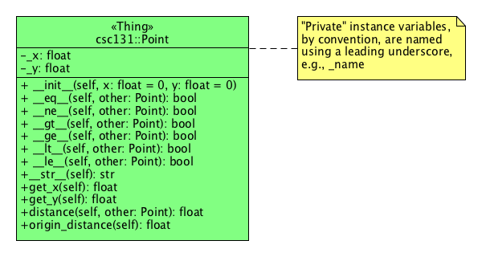

## Lab 04 - Introduction to Classes: Point

### Introduction

In this lab, we begin our excursion into developing object-oriented solutions by writing our first Python class. In this lab we'll write code code for a class named `Point` that represents a point in the Cartesian plane with _x_ and _y_ coordinates. The class contains:

* Two instance variables `_x` and `_y` that represent coordinates
* Several _methods_ that represent Point behavior, or operations
    * A method for _initializing_ `Point` objects (`__init__()`)
    * Some methods that are _inherited_ and _overridden_ that provide "extensions" to the Python language, e.g., methods that allow us to specify a string representation of `Point` objects, or to make comparison between `Point` objects (e.g., `p1 < p2`)
        * `__eq__(other)`: an implementation of the `==` operator for `Point` objects
        * `__ne__(other)`: an implementation of the `!=` operator for `Point` objects
        * `__gt__(other)`: an implementation of the `>` operator for `Point` objects
        * `__ge__(other)`: an implementation of the `>=` operator for `Point` objects
        * `__lt__(other)`: an implementation of the `<` operator for `Point` objects
        * `__le__(other)`: an implementation of the `<=` operator for `Point` objects
    * Some methods that specify particular behavior of the class under development (e.g., `distance()`)

Below is a _UML Class Diagram_ used to represent the Point class:



In the above class diagram, the top compartment is used to specify the name of the class, and in this case, some additional information like a _stereotype_ (a `Point` is a "Thing"), and package information (this `Point` class is defined in the `Point` module found in the `csc131` package).

The second compartment is used to specify _attributes_ of a class. Note here that each attribute (`_x` and `_y`) are preceded by a `-` which indicates _private_ scope. Unfortunately in Python, the notion of private data members is not enforced, so a convention is used to indicate private instances: anything private is named with a leading underscore character, e.g., `_x`.

The third compartment is used to specify _methods_ (also known as _operations_) of a class. Methods are functions that are encapsulated by instances of a class (i.e., _objects_). These functions are used to affect the _behavior_ of objects. In object-oriented speak, we say that we're sending a "message" to an object whenever we invoke an object's method. Every method of a Python class specifies as a first parameter, `self` which is a reference to the object receiving the message. This is useful whenever the method needs references to its own attributes. This is particularly interesting when we consider the way in which we can "extend" the Python language with certain built-in methods inherited by all classes in Python. For example, consider how the method `__eq__(self, other)` is used in Python code:

```python
p1 = Point(2, 3)
p2 = Point(2.4, 2.1)

if p1 == p2:
    print("These points are not the same coordinate!")
    
if p1.__eq__(p2):
    print("These points are not the same coordinate!")
```

As you can see, the first argument to `__eq__(self, other)` is implied; it's essentially the left-hand side of the expression `p1 == p2` and `other` is the right-hand side of the expression `p1 == p2`. In a similar manner, we can provide implementations of all the relational operators we're used to using, as well as other built-in binary operators like `+` (using `__add__(self, other)`)

### Tasks ###

In this lab, you will implement the `Point` class that supports all the relational operators as well as _accessor_ methods (`get_x(self)` and `get_y(self)`) and some additional useful methods:

* `distance(self: Point, other: Point) -> float:` This calculates the distance between this `Point` and the `other` point. For example

   ```python
   p1 = Point()
   p2 = Point(3, 4)
   d = p1.distance(p2)
   print(d) # should print 5
   ```
   
* `origin_distance(self: Point) -> float:` This calculates the distance between this `Point` and the origin.

   ```python
   p1 = Point(3, 4)
   d = p1.origin_distance()
   print(d) # should print 5
   ```
   
The formula for computing the distance between two points `p1 = (x1, y1)` and `p2 = (x2, y2)` is:

```python
from math import sqrt

sqrt((x2 - x1)**2 + (y2- y1)**2)
```

### Submission Details

The usual assignment protocol is followed:

1. Accept this assignment using the URL found in the Blackboard assignment which creates your repository in your GitHub account.
1. Clone your repository and create a branch named develop within which to do your work.
1. Implement the code indicated by the # TODO: comments.
1. Minimally make commits after finishing each function; more commits are encouraged but not required.
1. Once all the unit tests pass, push your final commit to GitHub and create a pull request, requesting to merge your develop branch into your master branch.
1. After the pull request is created, copy the URL of the pull request and paste it into a Text Submission on Blackboard. You should make the URL a working hyperlink that opens the pull request in a new browser window. NOTE: The assignment is officially submitted by the act of creating and submitting this Blackboard Text Submission and it is the timestamp of that activity that dictates when your assignment was actually submitted.

### Due Date

Your assignment must be submitted to Blackboard by 17:00 Tuesday 13 February 2018.les `x` and `y` that represent coordinates
